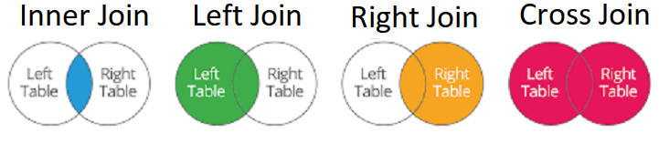

# conceitos_boas_praticas_postgreSQL
Repositório contendo experimentações, resumose tarefas baseados no curso "Conceitos e melhores práticas com bancos de dados PostgreSQL" ministrado por Daniel Roberto Costa

Arquivo postgresql.conf

Arquivo onde estão definidas e armazenadas todas as configurações do servidor PostgreSQL.

- Alguns parâmetros só podem ser alterados com uma reinicialização do banco de dados.

- A view pg_settings, acessada por dentro do banco de dados , guarda todas as configurações atuais.


## Uma view muito importante: pg_settings

Ela vai mostra aquilo que está em execução daquele dado momento, além de mostrar todas as configurações atuais do banco de dados.

```sql
SELECT name, settings FROM pg_settings;
```

### Localização do arquivo postgresql.conf

Por padrão encontra-se dentro do diretório PGDATA definido no momneto da inicilização do cluster de banco de dados.

No sistema operacional Ubuntu, se o PostgreSQL foi instalado a partir do repositório oficial, o local do arquivo postgresql.conf será diferente do diretório de dads.

```shell
/etc/postgresql/[versão]/[nome do cluster]/postgres.conf
```


## Configurações de conexão

- **LISTEN_ADDRESS**

  Endereço(s) TCP/IP das interfaces que o servidor PostgresSQL vai escutar/liberar conexões.

- **PORT**

  A porta tcp que o servidor PostgreSQL vai ouvir, O padrão é **5432**.

- **MAX_CONNECTIONS**

  Número máximo de conexões simultâneas no servidor PostgresSQL

- **SUPERUSER_RESERVED_CONNECTIONS**

  Número de conexões(slots) reservadas para conexões ao banco de dados de super usuários.

  

## Configurações de autenticação

- **AUTHENTICATION_TIMEOUT**

  Tempo máximo em segundos para o clientes conseguir uma conexão com o servidor

- **PASSWORD_ENCRYPTION**

  Algoritmo de criptografia das senhas dos novos usuários criados no banco de dados

- **SSL**

  Habilita a conexão criptografada por SSL

  (Somente se o banco de dados for compilado com SSL)


## Configuração de memória

- **SHARED_BUFFERS**

  Tamanho da memória compartilhada do servidor PostgreSQL para cache/buffer de tabelas, índices e demais relações.

- **WORK_MEM**

  Tamanho da memória para operações de agrupamento e ordenação (ORDER BY, DISTINCT, MERGE JOINS)

- **MAINTENANCE_WORK_MEM**

  Tamanho da memória para operações como VACUUM, INDEX, ALTER TABLE.


# O arquivo pg_hba.conf

Arquivo responsável pelo controle de autenticação dos usuários no servidor PostgreSQL. 

### Métodos de autenticação

- **TRUST:** conexão sem requisição de senha
- **REJECT:** rejeita conexões
- **MD5:** criptografia md5
- **PASSWORD:** senha sem criptografia
- **GSS:** generic security service application program interface
- **SSPI:** security support provider interface = somente para windows
- **KRB5:** kerberos v5
- **IDENT:** utiliza o usuário do sistema operacional do cliente via ident server
- **PEER:** utiliza o usuário do sistema operacional do cliente
- **LDAP:** ldap server
- **RADIUS:** radius server
- **CERT:** autenticação via certificado ssl do cliente
- **PAM**: pluggable authentication modules


# o arquivo pg_ident.conf

Arquivo responsável por mapear os usuários do sistema operacional com os usuários d banco de dados.

- Localizado no diretorio de dados PGDATA de sua instalação.
- A opção ident deve ser utilizada no arquivo **pg_hba.conf**


# Comando administrativos

### Ubuntu

- `pg_lscluster` : Lista todos os clusters PostgresSQL

- `pg_createcluster <version> <cluster name>`: Cria um novo cluster PostgresSQL

- `pg_dropcluster <version> <cluster>` : Apaga um cluster PostgresSQL.

- `pg_ctlcluster <version> <cluster> <action>`: pode realizar

  - Start
  - Stop
  - Status
  - Restart

  em clusters PostgresSQL

### CentOS

- `systemctl <action> <cluster>`:
  - `systemctl start postgresql-<version>`: Inicia o cluster
  - `systemctl status postgresql-<version>`: Mostra o status do cluster
  - `systemctl stop postgresql-<version>`: Para o cluster
  - `systemctl restart postgresql-<version>`: reinicia o cluster


### Windows

Abrir o gerenciador de serviços.


## Binários do PostgresSQL

//todo: estudar as funcionalidades de cada binário

- createdb:
- createuser:
- dropdb:
- dropuser:
- initdb:
- pg_ctl: start, stop , status, restart
- pg_basebackup: realiza o backup do banco
- pg_dump / pg_dumpall: extrair em um dado formato as informações daquele momento (pseudo-backup)
- pg_restore: restaurar os arquivos
- psql:
- reindexdb:
- vacuumdb:


# Arquitetura / Hierarquia

### Cluster

Coleção de banco de dados que compartilham as mesmas configurações (arquivos de configuração) do PostgreSQL e do ssitema operacional (porta, listen_addresses, etc)

### Database

Conjunto de schemas com seus objetos / relações (tabelas, funções, views, etc)

### Schema

Conjunto de schemas com seus objetos / relações (tabelas, funções, views, etc)

# Ferramenta PGAdmin

## Importante para conexão:

1. Liberar acesso ao cluster em postgresql.conf
2. Liberar acesso ao cluster para o usuário do banco de dados em pg_hba.conf
3. Criar / editar usuários


# Users / Roles / Groups

Roles(papéis ou funões), users(usuários) e grupo de usuários são "contas", papéis de atuação em um banco de dados, que possuem permissões em comum ou específicas.

Nas versões anteriores do PostgresSQL 8.1, usuários e roles tinham comportamento diferentes.

Atualmente, oles e users são alias (a mesma coisa)

É possível que roles pertençam a outras roles;


### Criação de uma role na base de dados

`CREATE ROLE name [[WITH] option [...]]`

#### As opções podem ser as seguintes:

- `SUPERUSER | NOSUPERUSER`
- `CREATEDB` | `NOCREATEDB`
- `CREATEROLE` | `NOCREATEROLE`
- `INHERIT` | `NONINHERIT`
- `LOGIN` | `NOLOGIN`
- `REPLICATION` | `NOREPLICATION`
- `BYPASSRLS` | `NO BYPASSRLS`
- `CONNECTION LIMIT connlimit`
- `[ENCRYPTED] PASSWORD "password"` | `PASSWORD NULL`
- `VALID UNTIL "timestamp" `
- `IN ROLE role_name[, ...] `
- `IN GROUP role_name [, ...]`
- `ROLE role_name[, ...]`
- `ADMIN role_name [, ...]`
- `USER role_name [, ...]`
- `SYSID uid`

### Associação entre roles

Quando uma role assume as permissões de outra role.

:warning: É  sempre necessário a presenção da opção **INHERIT**


No momento de criação da role: 

- **IN ROLE** (passa a pertencer a role informada)
- **ROLE** (a role informada passa a pertencer a nova role)

Ou após a criação da role:

- **GRANT** [role a ser concedida] TO [role a assumir as permissões]


### Exemplos da utilização das ROLES

```sql
CREATE ROLE professores
	NOCREATEDB
	NOCREATEROLE
	INHERIT
	NOLOGIN
	NOBYPASSRLS
	CONNECTION LIMIT 1;
	
CREATE ROLE daniel LOGIN CONNECTION LIMIT 1 PASSWORD '123' IN ROLE professores;
--Aqui a role daniel passa a assumir as permissões da role professores

CREATE ROLE daniel LOGIN CONNECTION LIMIT 1 PASSWORD '123' ROLE professor:
-- A role professores passa a fazer parte da role daniel assumindo suas permissões

CREATE ROLE daniel LOGIN CONNECTION LIMIT 1 PASSWORD '123'
GRANT professores TO daniel
```


### Desassociar membros entre roles

`REVOKE [ role que será revogada] FROM [ role que terá usas permissões revogadas]`

Exemplo: `REVOKE professores FROM  daniel`


## Alteração de role

`ALTER ROLE role_que_sera_alterada [ WITH ] option [ ... ]`

As opções de alteração são as mesmas de criação


## Excluindo uma role

`DROP ROLE nome_da_role_a_ser_excluida`

Exemplo: `DROP ROLE daniel`


## Administrando Acessos (GRANT)

Grants são privilégios de acesso aos objetos do banco de dados

### Lista de privilégios que podem ser atribuídas as roles

- `--tabela`
- `--coluna`
- `--sequence`
- `--database`
- `--domain`
- `--foreign data wrapper`
- `--foreign server`
- `--function`
- `--language`
- `--large object`
- ` --schema`
- `--tablespace`
- `--type` 

### Database

```sql
GRANT {{CREATE |  CONNECT | TEMPORARY | TEMP }[, ...] | ALL [PRIVILEGES]}
ON DATABASE database_name [, ...]
TO role_especifica [, ...] [WITH GRANT OPTION]
```

### SCHEMA

```SQL
GRANT {{CREATE | USAGE }, [, ...] | ALL[PRIVILEGES]}
ON SCHEMA  schema_name[, ...]
TO role_especifica [,  ...] [WITH GRANT OPTION]
```

### TABLE

```SQL
GRANT{{SELECT | INSERT | UPDATE | DELETE | TRUNCATE | REFERENCES | TRIGGER } [, ...] | ALL [PRIVILEGES]}
ON { [TABLE] table_name[, ...] | ALL TABLE IN SCHEMA schema_name[,  ...] } TO role_especifica[, ...] [WITH GRANT OPTION]
```

### Removendo privilégios de uma role

###  Database

```SQL
REVOKE [GRANT OPTION FOR]
{{CREATE | CONNECT | TEMPORARY | TEMP}[, ...] | ALL [PRIVILEGES]}
ON  DATABASE database_name [, ...]
FROM {[GROUP]role_especifica | PUBLIC}[,  ...]
[CASCADE | RESTRICT]
```

 

### SCHEMA

```SQL 
REVOKE [GRANT OPTION FOR]
{{CREATE | USAGE}[, ...] | ALL[PRIVILEGES]}
ON SCHEMA schema_name[, ...]
FROM {[GROUP]role_especifica | PUBLIC}[, ...]
[CASCADE | RESTRICT]
```


###  Revogando todas as permissões

`REVOKE ALL ON ALL TABLES IN SCHEMA [shema] FROM [role];`

`REVOKE ALL ON SCHEMA [shema] FROM [role]`

`REVOKE ALL ON DATABASE [database] FROM [role];`


# Objetos e comandos do banco de dados

## Database , Schemas e Objetos

**Database**

É o banco de dados, um grupo de schemas e seus objetos

**Schemas**

É  um grupo de objetos, como tabelas, types, views, funções , entre outros.

**Objetos**

São tabelas, views funções , types, sequences , entre outros pertencentes ao schemas.


## Comandos Database

`CREATE DATABASE name`

`DROP DATABASE [nome]`

## Comando Schema

`CREATE SCHEMA schema_name [AUTHORIZATION role_especifica]`

`ALTER SCHEMA name RENAME TO new_name`

`DROP SCHEMA [nome]`


:arrow_forward: **É  um boa prática implementar idempotência nas tarefas realizadas dentro da base de dados, com no esquema abaixo**

`CREATE SCHEMA IF NOT EXISTS schema_name [AUTHORIZATION role_especifica]`

`DROP SCHEMA IF EXISTS [nome]`


# Tabela colunas e tipos de dados

É  um conjunto de dados dispostos em colunas e linhas referentes a um objetivo comum.

## Primary Key

No conceitos de modelo de dados relacional e obedecendo as regras de normalização , uma PK  é um conceito de um ou mais campos que nunca se repetem em uma tabea e que seus valores farantem a integridade do dado único e a utilização do mesmo como referência para o relacionamente entre demais tabela.

- Não pode haver duas ocorrências de uma mesma entidade com o mesmo conteúdo na PK
- A chave primária não pode ser composta por atributo opcional, ou seja, atributo que aceito nulo.
- Os atributos identificadores devem ser o conjunto mínimo que pode identificar cada instância de um entidade.
- Não deve ser usadas chaves externas (depende)
- Não deve conter informação volátil


## Foreign Key

Campo, ou conjunto de campos que são referências de chaves primárias de outras tabelas ou da mesma tabela.

Sua principal função é garantir a integridade referencial entre tabelas

- Sempre referencia uma PK


## Tipos de dados

- **Numeric types** 
- **Monetary types** :moneybag:
- **Character types** :pencil2:
- **Binary data types**
- **Data / time types**
- **Boolean type**
- **Enumerated type**
- **Geometric types**
- **Network Adress Types (IP)** 
- **Bit String types**
- **Text search types**
- **UUID type**
- **XML type**
- **JSON type**
- **Arrays type**
- **Composite type**
- **Range type**
- **Domain type**
- **Object Identifier type**
- **pg_Isn type**
- **Pseudo-Types**


# DML e DDL


### Exemplos DML

#### INSERT


***

#### UPDATE


***

#### DELETE


***

#### SELECT


### Exemplos DDL


# Conheça o DML e o Truncate

## Idempotência

Propriedade que algumas ações / operações possuem possibilitando-as de serem executadas diversas vezes sem alterar o resultado inicial.


### Melhores práticas em DDL

Importante as tabelas possuírem campos que realmente serão utilizados e que sirvam de atributo direto a um objetivo em comum.

- Criar / Acrescentar colunas que são "atributos básico" do objeto;
- Cuidado com regras (**constraints**)
- Cuidado com o excesso de FKs
- Cuidado com o tamanho indevido de FKs


## DML - CRUD (Create, Read, Update, Delete)

## SELECT 

`SELECT (campos,) FROM tabela [condições]`

### Exemplo:

- `SELECT numero, nome FROM banco;`
- `SELECT numero, nome FROM banco WHERE ativo IS TRUE;`
- `SELECT nome FROM cliente WHERE email LIKE '%gmail.com';`


:arrow_forward: `LIKE`: Respeita case sensitive

:arrow_forward: `ILIKE`: Não respeita o case sensitive


###  SELECT  - Condição (WHERE / AND / OR)

A primeira condição sempre começa com **WHERE** ,  e as demais condições com **AND** ou **OR** .

Operador possível:

-  `=`
- `>` / `>=`
- `<` /  `<=`
-  `<>` /  `!=`
- `LIKE` /  `ILIKE`
- `IN` 


## INSERT

`INSERT (campos da tabela) VALUES (valores)` ou

`INSERT (campos da tabela) SELECT (valores)`

### INSERT - Idempotência

 `INSERT INTO agencia(banco_numero, numero, nome) VALUES (341, 1, 'VITOR KOGAWA') ON CONFLICT (banco_numero, numero) DO NOTHING `

:arrow_forward: `ON CONFLICT`: Trabalha com base nas `constraints` , no exemplo acima caso ocorra algum erro com as PK a query não vai fazer nada (`DO NOTHING`) 


## UPDATE

`UPDATE (tabela) SET campo1 = novo_valor WHERE (condição)`

:warning: Sempre utilize o `UPDATE`  com alguma condição 


## DELETE

`DELETE from tabela WHERE (condição)` 


# TRUNCATE

Esvazia sua tabela

```sql
TRUNCATE [ TABLE ] [ ONLY ] name [*][, ...]
[ RESTART IDENTITY | CONTINUE IDENTITY ] [ CASCADE | RESTRICT ]
```

- `RESTART IDENTITY` : Reseta o valor do id com relação ao valor informado.
- `CASCADE`: Apaga as referências da tabela truncada em outras também (cuidado)


# Funções agregadas em PostgreSQL

Existem diversas funções agregadas , e elas podem ser encontradas na documentação da PostgreSQL, porém as mais recorrentes são:

- **AVG**
- **COUNT (Opção: HAVING)**
- **MAX**
- **MIN**
- **SUM**


## AVG

Retorna a média dos valores de uma dada coluna de uma tabela

`SELECT AVG(coluna) FROM tabela`

#### Exemplo

```sql
SELECT AVG(valor) FROM cliente_transacoes;
```


## COUNT

Retorna a quantidade de registros de uma dada coluna e pode ser usado junto com `GROUP BY` para agrupar determinadas colunas e com o `HAVING` para filtrar .

`SELECT COUNT(coluna) FROM tabela`

#### Exemplo

```sql
	SELECT COUNT(id), tipo_transacao_id
	FROM cliente_transacoes
	GROUP BY tipo_transacao_id
	HAVING COUNT(id) > 150;
```

 

## MAX

Retorna o valor máximo de uma coluna

`SELECT MAX(coluna) FROM tabela`

#### Exemplo

```sql 
	SELECT max(numero) FROM cliente;
	SELECT max(valor), tipo_transacao_id
	FROM cliente_transacoes
	GROUP BY tipo_transacao_id;
```


## MIN

Retorna o valor mínimo de uma coluna

`SELECT MIN(coluna) FROM tabela`

#### Exemplo

```sql
	SELECT min(numero) FROM cliente;
	SELECT min(valor), tipo_transacao_id
	FROM cliente_transacoes
	GROUP BY tipo_transacao_id;
```


## SUM

Retorna a soma dos valores de uma dada coluna

`SELECT SUM(coluna) FROM tabela`

#### Exemplo

```sql
	SELECT sum(valor), tipo_transacao_id
	FROM cliente_transacoes
	GROUP BY tipo_transacao_id
	ORDER BY tipo_transacao_id DESC
```


# JOIN

São utilizados durante o desenvolvimento da consulta:

### Tipos de JOIN

- `JOIN`
- `LEFT JOIN`
- `RIGHT JOIN`
- `FULL JOIN`
- `CROSS JOIN`


##  JOIN (INNER)

Ao realizar o `JOIN` ou`INNER JOIN`, será retornado somente os registros em comum as tabelas envolvidas.

```sql
SELECT tabela1.campos, tabela2.campos
FROM tabela_1
JOIN tabela_2
ON tabela_2.campo = tabela_1.campo
```


## LEFT JOIN (LEFT OUTER JOIN)

Retorna todos os registros envolvidos da tabela a esquerda , mais os registros relacionados a tabela da direita, retornando null para os valores não relacionados.

```sql
SELECT tabela_1.campos, tabela_2.campos
from tabela_1
LEFT JOIN tabela_2
ON tabela_2.campo = tabela_1.campo
```


## RIGHT JOIN (RIGHT OUTER JOIN)

Retorna todos os registros envolvidos da tabela a **direita** , mais os registros relacionados a tabela da **esquerda**, retornando null para os valores não relacionados.

```sql
SELECT tabela_1.campos, tabela_2.campos
from tabela_1
RIGHT JOIN tabela_2
ON tabela_2.campo = tabela_1.campo
```


## FULL JOIN (FULL OUTER JOIN)

Retorna todos os registros relacionados entre as tabelas envolvidas , junto aos registros não relacionados de todas as tabelas envolvidas 

```sql
SELECT tabela_1.campos, tabela_2.campos
from tabela_1
FULL JOIN tabela_2
ON tabela_2.campo = tabela_1.campo
```


## CROSS JOIN

Todos os dados de uma tabela serão cruzados com todos os dados da outra tabela , retornando uma matriz.

```sql
SELECT tabela_1.campos, tabela_2.campos
FROM tabela_1
CROSS JOIN tabela_2
```





# CTE -  Common Table Expressions

Forma auxiliar de organizar "statements", ou seja, blocos de códigos , para consultas muito grandes, gerando tabelas temporárias e criando relacionamentos entre elas.

# Views

- São visões
- São camadas para as tabelas
- São alias para uma ou mais queries
- Aceitam os seguintes comandos:
  -  select
  - insert
  - update
  - delete

Os comando insert, update e delete só vão funcionar para views referentes a 1 única tabela.


## Views - Imdepotência

```sql 
CREATE OR REPLACE VIEW vv_bancos(banco_numero, banco_nome, 	banco_ativo) as (
	select numero, nome, ativo from banco
)
```


## Views - Temporary

View temporária

```sql
CREATE OR REPLACE TEMPORARY VIEW vv_banco AS (
	SELECT numero, nome, ativo
    FROM banco
)
```

- Presente apenas na sessão do usuário
- Se você se desconectar e conectar novamente, a VIEW não estará disponível.


## Views - Recursive

Chame a ela mesma

```SQL
CREATE OR REPLACE RECURSIVE VIEW (nome_da_view)(campos_da_view) AS (
	SELECT base
   	UNION ALL 
    SELECT campos
    FROM tabela_base
    JOIN(nome_da_view)
)
```

- Obrigatório a presença de UNION ALL


# Transações

Conceito fundamental de todos os sistemas de bancos de dados.

Conceito de múltiplas etapas / códigos reunidos em apenas 1 transação, onde o resultado precisa ser **tudo ou nada**

Principais comando:

- BEGIN
- ROLLBACK
- COMMIT
- SAVEPOINT


#  FUNÇÕES

Conjunto de códigos que são executados dentro de uma transação com a finalidade de facilitar a programação e obter o reaproveitamento / reutilização de códigos.

Tipos de funções:

- query language function (escritas em SQL)
- procedural language function (escritas por exemplo em PL / pgSQL ou PL/py)
- internal function
- C-Language function

**USER DEFINED FUNCTION** são funções criadas pelo próprio usuário e são escritas em SQL.

## FUNÇÕES COM IDEMPOTÊNCIA

`CREATE OR REPLACE FUNCTION [nome da função]`

**Regras para trabalhar de com idempotencia com funções:**

- Mesmo nome
- Mesmo tipo de retorno
- Mesmo número de parâmetros / argumentos

**Tipos de returns permitidos:**

- integer
- char / varhcar
- boolean
- row
- table
- json

**Segurança:**

- SECURITY
  - REVOKE
  - DEFINER

**Comportamento:**

- IMMUTABLE: Não pode alterar o banco de dados, 
- STABLE: Não pode alterar o banco de dados, se dá melhor current_timestamps
- VOLATILLE: Comportamento padrão, aceita todos os cenários


**Boas práticas**

- CALLED ON NULL INPUT

  Padrão, se qualquer um dos parâmetros / argumentos for NULL, a função será executada.

- RETURN NULL ON NULL INPUT

  Se qualquer um dos parâmetros / argumentos for NULL, a função retornará NULL

- SECURITY INVOKER

  função execta com as permissões de quem executa

- SECURITY DEFINER

  função exeucta com as permissões de que a criou

- COST

  Custo / row em unidades de CPU

- ROWS

  Número estimado de linhas que será analisada pelo planner


## SQL FUNCTIONS

- Não é possível utilizar transactions


### Exemplo

```sql
CREATE OR REPLACE FUNCTION fc_somar(INTEGER, INTEGER)
RETURNS INTEGER
LANGUAGE SQL
AS $$
	SELECT $1 + $2;
$$

--OU

CREATE OR REPLACE FUNCTION fc_somar(num1 INTEGER, num2 INTEGER)
RETURNS INTEGER
LANGUAGE SQL
AS $$ 
	SELECT num1 + num2
$$
```

```sql
CREATE OR REPLACE FUNCTION banco_add(p_numero integer, p_nome varchar, p_Ativo boolean)
returns boolean
language plpgsql
as $$
declare variavel_id integer
begin
	select into variavel_id numero from banco where nome = p_nome;
	if variavel_id is null then
		insert into banco (numero, nome, ativo) values (p_numero, p_nome, p_ativo);
	else
		returns false;
	end if;
	select into variavel_id numero from banco where nome = p_nome;
	if variavel_i is null then
		return false;
	else
		return true;
	end if
end; $$
```


# DICAS

:arrow_forward:  Para listar todas as colunas e os seus respectivos tipos de uma determinada tabela , basta consultar a view `information_schema.columns` passando como parâmetro de condição o `table_name`.

`SELECT column_name, data_type FROM information_schema.columns WHERE table_name = 'nome_da_sua_tabela'`


 

